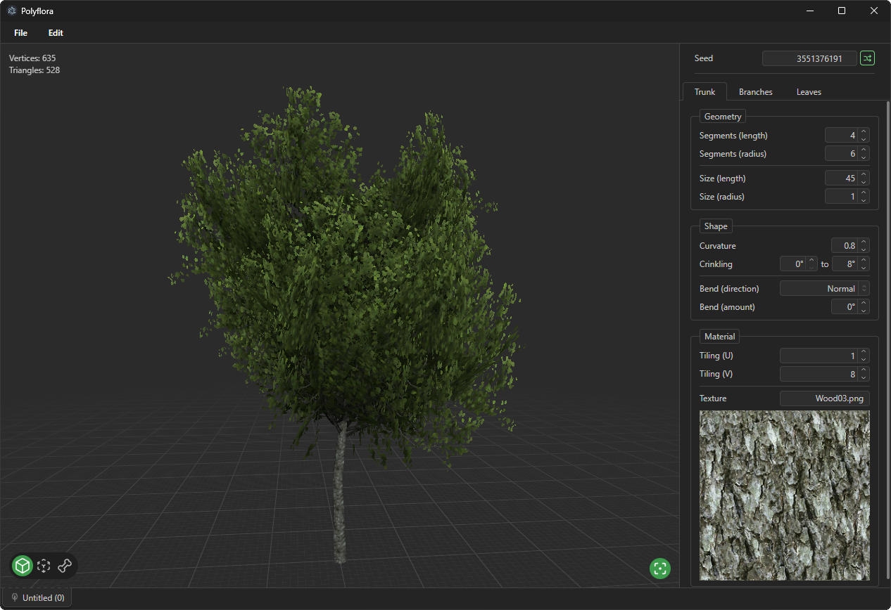

<picture>
    <source media="(prefers-color-scheme: dark)" srcset="./fix/doc/header-dark.svg">
    <source media="(prefers-color-scheme: light)" srcset="./fix/doc/header-light.svg">
    
</picture>

## 🚧🚧 Currently in construction 🚧🚧

A low-poly tree software generator that runs on the browser (or Electron).

To preview the software, run `pnpm install`, and then `pnpm run dev` (or `pnpm run electron-dev` for the electron version